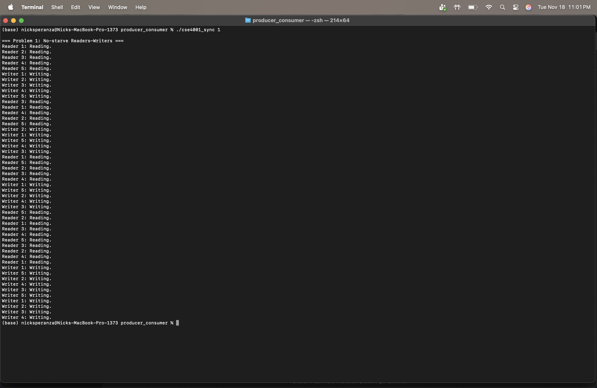
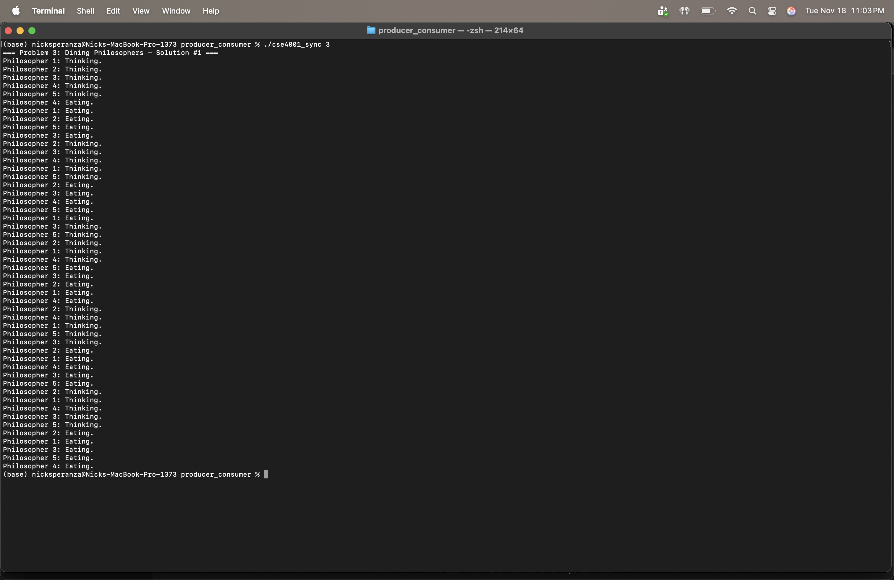
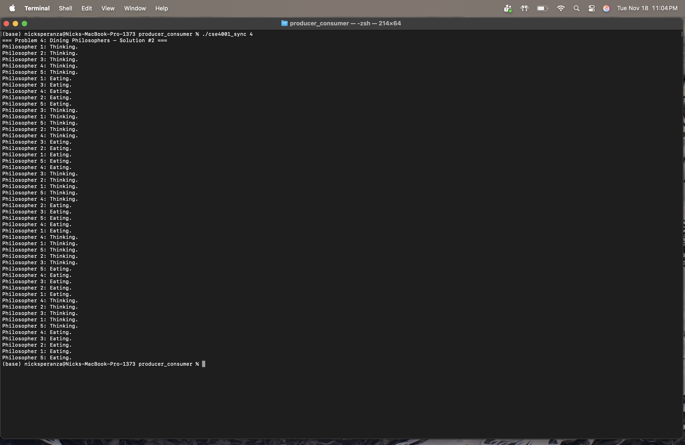

# CSE 4001 – Synchronization Problems

This project implements four classical synchronization problems using semaphores,
based on solutions from *The Little Book of Semaphores* by Allen B. Downey.
All solutions use POSIX threads and the provided `Semaphore` class.

---

## Build Instructions

From the project directory, run:

make

This produces an executable:

cse4001_sync

---

## Run Instructions

Use:

./cse4001_sync <problem #>

Where:

1 = No-starve Readers–Writers  
2 = Writer-priority Readers–Writers  
3 = Dining Philosophers – Solution #1 (limit = 4)  
4 = Dining Philosophers – Solution #2 (odd/even fork strategy)

---

# Problem Outputs

Below are screenshots demonstrating that each synchronization solution works.

## Problem 1 – No-starve Readers–Writers
Readers share with a lightswitch and writers pass through a turnstile to prevent starvation.

---

## Problem 2 – Writer-priority Readers–Writers
Writers block new readers using `readTry`, giving writers priority.

---

## Problem 3 – Dining Philosophers (Solution #1)
Deadlock avoided by allowing only 4 philosophers to sit at the table at once.

---

## Problem 4 – Dining Philosophers (Solution #2)
Deadlock avoided by breaking fork-pickup symmetry (odd = left first, even = right first).

---

## Repository Files

main.cpp — Full implementation of all four problems  
semaphore_class.h — Semaphore implementation (provided)  
makefile — Builds the executable  
screenshots/ — Output screenshots

---

## Notes

- macOS may warn that `sem_init` and `sem_destroy` are deprecated — this is expected and OK.
- Jumbled output is normal because multiple threads print simultaneously.

